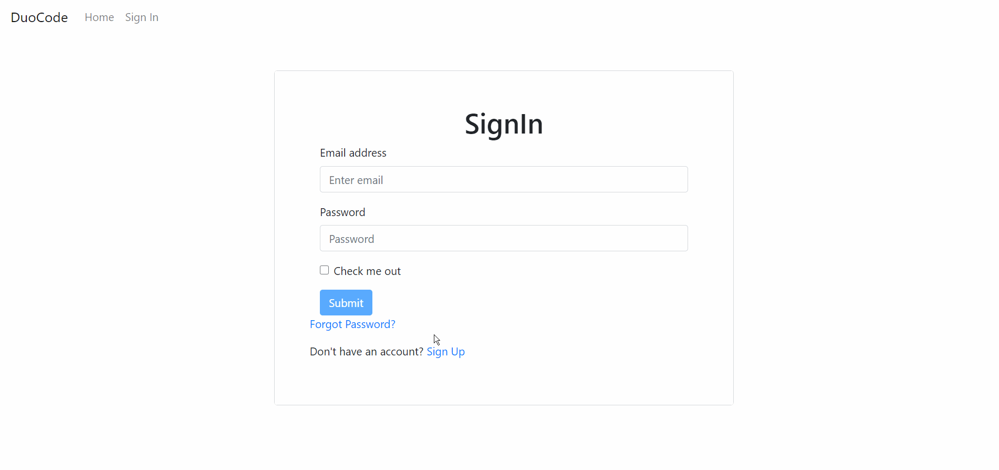

# DuoCode

**Award outstanding ideas in MindX Hackathon 2020**

**Inperation:** \
We made DuoCode for everyone interested in coding or computer science to step foot inside this field. \
Main mission: interactive IDE workspace to encourage networking and pair programming with other students. \
The website has two main features: Networking and Pair programming.

**Process:** 
1. We use authentication by Google Firebase and store user infomation with Firestore
2. We stored our database with mongoDB Atlas
3. We built Back-End RESTful API with Node.js, JavaScript
4. We built Front-End with React, React-Bootstrap

**Team:** \
Trang Hoang \
Long Pham \
Hanh Nguyen
